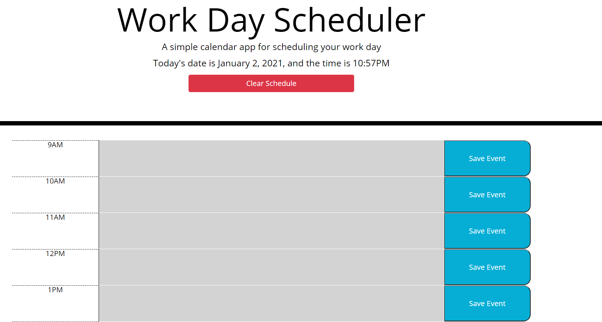

# InteractiveCalendar
A calendar used for scheduling
## Link to My Deployed Application

https://joeseff6.github.io/InteractiveCalendar/
## Project Description

The purpose of this project is to build an interactive calendar using jQuery and javascript libraries.
## What to Expect From the Application

This web application will provide a calendar that the user can utilize to schedule tasks for the workday (using standard American work hours from 9am to 5pm). Using data persistence and local storage, the user will be able to go back to the calendar at a later time and either add or delete calendar events. The application will also color code each hourly row depending on if the local time is before, during, or after the specified hour.

## Tasks to Complete the Job :white_check_mark:
- [x] Display the current day upon opening the calendar
- [x] Present time blocks each hour, from 9am to 5pm
- [x] Color code time blocks depending on the current time relative to the hour block
- [x] Allow user to enter an event, and save that event to storage 
- [x] Ensure the events are saved to persist after page refresh

## Future Releases

* Have rows change color based on current hour without having to refresh page
* Add button to clear events

### Screenshots

